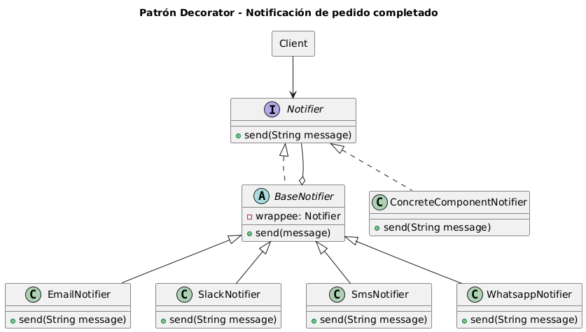

1. **Notificaciones a los clientes.**

En tu empresa están desarrollando una plataforma de comercio electrónico. Actualmente, cuando un pedido es completado, se le notifica al cliente por correo electrónico.
El equipo de producto ha solicitado una nueva funcionalidad: quieren poder enviar notificaciones por múltiples canales. Es decir, a futuro, un cliente podría recibir su notificación por:

● Correo electrónico

● SMS

● WhatsApp

● Slack

● ...u otros canales en el futuro
La clave es que los canales de notificación pueden variar por cliente, y también podrían combinarse (por ejemplo: un cliente recibe el mensaje por Correo + WhatsApp, otro por Slack + SMS, etc.).
Inicialmente el sistema se había diseñado con una clase NotificadorCorreo, pero agregar canales adicionales mediante herencia (NotificadorCorreoSMS, NotificadorCorreoSMSWhatsApp, etc.) resulta en una explosión de clases y una estructura difícil de mantener.
¿Cómo rediseñarías el sistema para permitir una combinación flexible y extensible de canales de notificación, evitando duplicación de código y sin depender de una jerarquía rígida de clases?
Diseña la solución, permitiendo que:

● Se pueden combinar múltiples canales

● El comportamiento se pueda extender fácilmente con nuevos tipos de notificación

● No se cree una clase por cada combinación de canales
Criterios que debe cumplir tu solución:

● Código abierto a extensión, cerrado a modificación (principio OCP)

● No se debe duplicar lógica común de envío de notificaciones

● Los canales deben poder agregarse o quitarse en tiempo de ejecución

● La solución debe ser limpia y mantenible

**Diagrama de clases de la solución**

 

**Descripción General**

Decorator es un patrón de diseño estructural que te permite añadir funcionalidades a objetos colocando estos objetos dentro de objetos encapsuladores especiales que contienen estas funcionalidades.