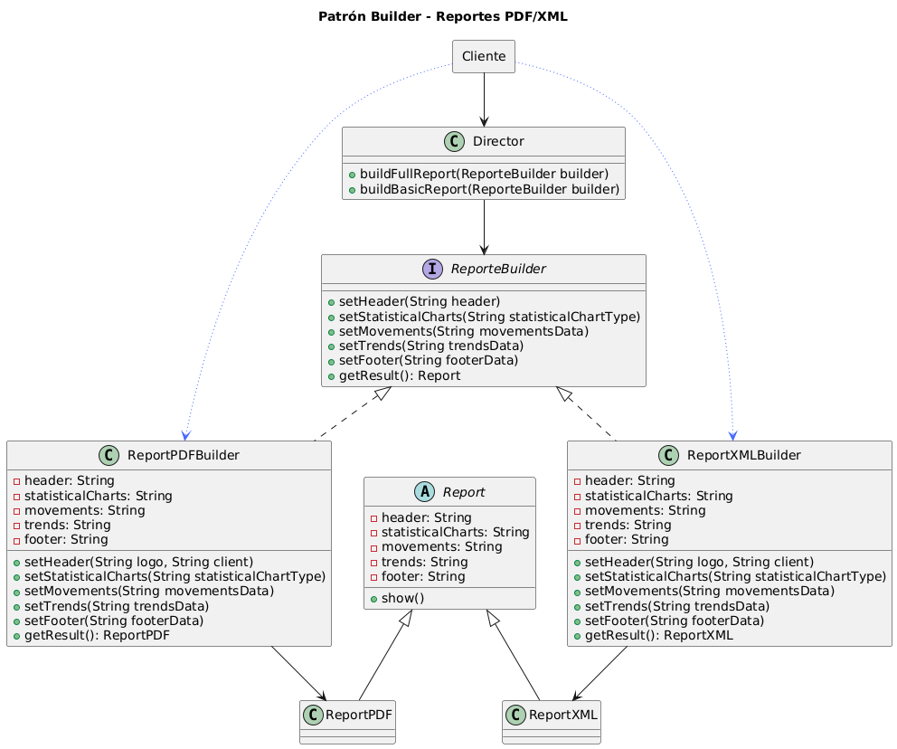

2**Constructor de Reportes Personalizados**

Estás trabajando en un sistema que genera reportes PDF personalizados para los clientes de una entidad financiera.
Cada cliente puede pedir un reporte con diferentes secciones opcionales, como:

● Portada con logotipo y nombre del cliente

● Gráficos estadísticos (de inversión, ahorro, etc.)

● Tabla de movimientos recientes

● Análisis de tendencias

● Pie de página con contacto del asesor
Actualmente, hay una clase ReportePDF con un constructor que recibe muchos parámetros (unos obligatorios y otros opcionales), y se ha vuelto difícil de mantener, porque:

● Algunos parámetros no se usan siempre

● El orden de los parámetros es confuso

● A veces los desarrolladores crean reportes con configuraciones inválidas

● Hay muchos null al llamar al constructor

● Agregar una nueva sección al reporte obliga a modificar varias partes del código existente
Además, algunos clientes requieren que los reportes se generen de forma progresiva, dependiendo de condiciones dinámicas en tiempo de ejecución. Por ejemplo, si el usuario tiene datos suficientes, se incluye el análisis de tendencias; si no, se omite.
¿Cómo rediseñarías el sistema para construir objetos ReportePDF de forma clara, flexible y segura, evitando constructores complejos y errores de configuración?
Diseña la solución, permitiendo:

● Crear reportes personalizados con secciones opcionales

● Asegurar que los reportes se construyan solo cuando estén correctamente configurados

● Mantener el código limpio y fácil de extender si se agregan nuevas secciones
Criterios que debe cumplir tu solución:

● El código debe ser legible y fluido

● Debe ser seguro frente a mal uso (por ejemplo, no permitir construir un objeto incompleto)

● Debe permitir agregar o quitar secciones fácilmente
● El objeto final debe ser inmutable una vez construido

**Descripción**

Builder es un patrón de diseño creacional que nos permite construir objetos complejos paso a paso. El patrón nos permite producir distintos tipos y representaciones de un objeto empleando el mismo código de construcción.