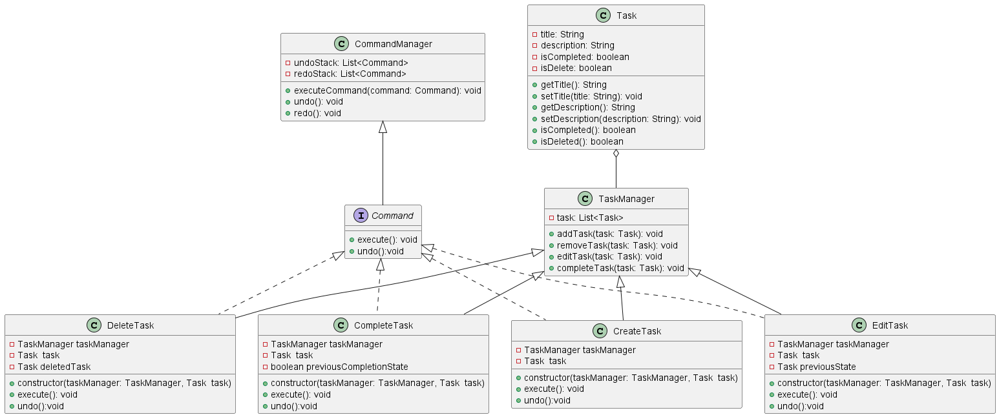

3. **Sistema de Gestión de Tareas**

Imagina un sistema de gestión de tareas en el que los usuarios pueden crear, editar, eliminar y completar tareas. Cada acción realizada por el usuario corresponde a una acción que debe ser ejecutada. Además, es importante mantener un registro de todas las acciones realizadas para permitir la reversión de las mismas si es necesario.

**Aplicación del Patrón:**

En este escenario, el patrón será aplicado para encapsular cada una de las acciones que el usuario puede realizar sobre una tarea.
El patrón que seleccione debe tener los siguientes beneficios:

● Desacopla el invocador de los objetos que realizan las acciones.

● Permite la extensión de nuevas operaciones sin modificar el código existente.

● Facilita el registro de acciones para realizar operaciones de reversión.

**Diagrama de clases de la solución**

**Consideraciones**

### **Documentación del Sistema de Gestión de Tareas con Patrón Command**

**Descripción General**

El sistema implementa el Patrón Command para gestionar operaciones sobre tareas, permitiendo ejecutar, deshacer (undo) y rehacer (redo) acciones.
Este patrón encapsula cada operación en un objeto comando, separando así la lógica de ejecución de la solicitud que la desencadena.
El diseño favorece:

Desacoplamiento entre la lógica de ejecución y el cliente.

Historial de operaciones para revertir cambios.

Extensibilidad para nuevos tipos de comandos sin modificar código existente.

---

**Clases Principales**

###### *Command (Interfaz)*

Define la estructura que deben seguir todos los comandos del sistema.

Métodos:

execute(): Ejecuta la acción.

undo(): Revierte la acción ejecutada.

Esta interfaz es implementada por todos los comandos concretos como CreateTask, DeleteTask, EditTask y CompleteTask.

###### *CommandManager*

Controla la ejecución y el historial de comandos.

###### Atributos:

undoStack: List<Command> → Pila de comandos ejecutados para deshacer.

redoStack: List<Command> → Pila de comandos deshechos para rehacer.

Métodos:

executeCommand(command: Command): Ejecuta un comando y lo almacena en la pila de undo.

undo(): Revierte el último comando ejecutado.

redo(): Reejecuta el último comando deshecho.

 **Task**
 
Representa una tarea individual.

Atributos:

title: String

description: String

isCompleted: boolean

isDelete: boolean

Métodos:

getTitle() / setTitle(title)

getDescription() / setDescription(description)

isCompleted()

isDeleted()

**TaskManager**

Gestiona la colección de tareas.

Atributos:

task: List<Task>

Métodos:

addTask(task: Task): Añadir tarea.

removeTask(task: Task): Eliminar tarea.

editTask(task: Task): Editar tarea existente.

completeTask(task: Task): Marcar tarea como completada.

---

**Comandos Concretos**
 
######  CreateTask
 
Crea una nueva tarea.

Atributos:

taskManager: TaskManager

task: Task

Métodos:

execute(): Agrega la tarea.

undo(): Elimina la tarea agregada.

###### DeleteTask

Elimina una tarea existente.

Atributos:

taskManager: TaskManager

task: Task

deletedTask: Task (para restaurar en undo)

Métodos:

execute(): Elimina la tarea.

undo(): Restaura la tarea eliminada.

###### EditTask
 
Edita una tarea existente.

Atributos:

taskManager: TaskManager

task: Task

previousState: Task (para revertir cambios)

Métodos:

execute(): Aplica cambios.

undo(): Restaura el estado anterior.

###### CompleteTask

Marca una tarea como completada.

Atributos:

taskManager: TaskManager

task: Task

previousCompletionState: boolean

Métodos:

execute(): Marca como completada.

undo(): Restaura estado anterior.

---

**Flujo de Ejecución**

El cliente crea un comando (CreateTask, DeleteTask, etc.) y lo pasa a CommandManager.

CommandManager ejecuta el comando y lo guarda en la pila de undoStack.

Si el usuario deshace, el comando se mueve a redoStack.

Si el usuario rehace, el comando se ejecuta de nuevo y vuelve a undoStack.