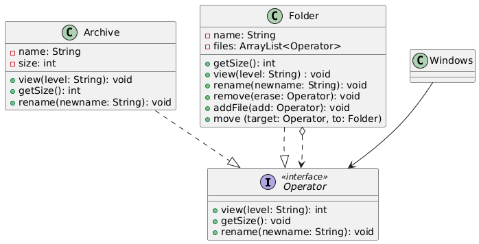

4**Sistema de Gestión de Archivos y Carpetas**

Estás desarrollando un módulo para un sistema operativo educativo que simula una estructura de archivos y carpetas, como el explorador de archivos de Windows o Linux.
Se necesita representar:

● Archivos individuales, con un nombre y un tamaño en bytes.

● Carpetas, que pueden contener archivos y otras carpetas dentro de ellas (de forma recursiva).
El objetivo es que se puedan realizar operaciones como:

● Obtener el tamaño total de una carpeta (suma del tamaño de todos sus archivos y subcarpetas)

● Imprimir el contenido de una carpeta de forma jerárquica

● Aplicar acciones como borrar, renombrar o mover un elemento (sin importar si es archivo o carpeta)
Actualmente, el equipo tiene dos clases distintas: Archivo y Carpeta, y cada una tiene métodos diferentes. Esto ha llevado a:

● Mucho código duplicado en los métodos que recorren el árbol de archivos

● Estructuras condicionales (if o instanceof) para saber si se está tratando con un archivo o carpeta

● Dificultades al agregar nuevas operaciones comunes a ambos tipos de elementos

¿Cómo rediseñarías este modelo para que archivos y carpetas puedan tratarse de forma uniforme, y se puedan recorrer y operar sobre ellos recursivamente y sin condicionales?
Diseña la solución , permitiendo:

● Tratar archivos y carpetas con una interfaz común

● Calcular el tamaño de una carpeta sin importar cuántos niveles de subcarpetas haya

● Extender la estructura fácilmente con nuevos tipos de elementos (como accesos directos o enlaces)
Criterios que debe cumplir tu solución:

● El diseño debe permitir composición recursiva

● Las operaciones deben funcionar sin necesidad de saber si el objeto es archivo o carpeta

● Debe ser abierto a extensión, pero sin modificar las clases existentes

● El cliente del sistema no debe tener que usar instanceof o if para saber cómo interactuar con cada tipo de elemento

**Diagrama de clases de la solución**

**Descripción**

Composite es un patrón de diseño estructural que te permite componer objetos en estructuras de árbol y trabajar con esas estructuras como si fueran objetos individuales.
